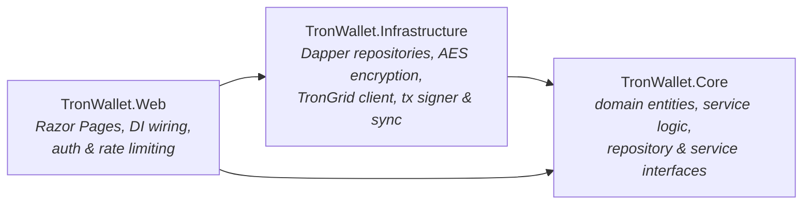

# TronWallet

A custodial [TRON](https://tron.network/) wallet web application built with **ASP.NET Core 9 Razor Pages** in a clean three-layer architecture (Core / Infrastructure / Web).

Users register, get a TRON address, and manage their funds through a web cabinet: a balance dashboard, send and receive flows, and a transaction history kept in sync with the chain. Transactions are signed **offline** (TronNet + Protobuf) and broadcast through the [TronGrid](https://www.trongrid.io/) API — private keys never leave the server, where they are stored AES-encrypted. Authentication uses BCrypt password hashing with rotating refresh tokens. Persistence is **PostgreSQL** accessed via **Dapper**.

Runs against the **Shasta testnet** by default; the network is configurable to mainnet.

> ⚠️ Educational / portfolio project. Not audited — do not use it to hold real funds.

## Features

- **Account management** — registration and login with cookie-based sessions and rate-limited endpoints
- **Wallet generation** — a fresh TRON key pair per user; the private key is encrypted at rest, only the Base58Check address is exposed
- **Send TRX** — transactions are built, signed locally with the decrypted key, and broadcast via TronGrid
- **Receive** — displays the wallet address for incoming transfers
- **Balance dashboard** — live account balance fetched from the chain
- **Transaction history** — a background sync service ([`TransactionSyncService`](src/TronWallet.Infrastructure/Tron/TransactionSyncService.cs)) polls TronGrid and reconciles on-chain transactions into the local database, tracking pending → confirmed status

## Architecture

Three projects with a strict inward dependency direction — `Web → Infrastructure → Core`, and `Core` depends on nothing:



- **`TronWallet.Core`** — domain entities (`User`, `Wallet`, `WalletTransaction`, `RefreshToken`), the application services (`AuthService`, `WalletService`, `TransactionService`), and the interfaces everything else implements. No framework or database references.
- **`TronWallet.Infrastructure`** — implementations: PostgreSQL repositories (Dapper), the AES encryption service, and the TRON integration (TronGrid HTTP client, offline transaction signer, address service, background sync).
- **`TronWallet.Web`** — Razor Pages UI (`Auth` and `Cabinet` areas), configuration, and dependency-injection composition root.

The database schema lives in [`sql/init.sql`](sql/init.sql): `users`, `wallets`, `transactions`, and `refresh_tokens`.

## Security design

- **Offline signing** — raw transactions are built and signed in-process; private keys are never sent to any external API
- **Keys encrypted at rest** — wallet private keys are stored AES-256-GCM-encrypted; the encryption key comes from configuration, never the database
- **BCrypt** password hashing
- **Rotating refresh tokens** — tokens are single-use and stored only as SHA-256 hashes, with IP / user-agent metadata and revocation support
- **Rate limiting** on authentication endpoints
- **No secrets in the repo** — `appsettings.json` ships with placeholders; real values belong in user-secrets or environment variables

The custodial model is a deliberate trade-off: the server holds the keys so users don't manage seed phrases, at the cost of the server being a high-value target. For a production system this would call for an HSM/KMS-backed key store, audits, and withdrawal limits — out of scope for a portfolio project.

## Getting started

### Prerequisites

- [.NET 9 SDK](https://dotnet.microsoft.com/download/dotnet/9.0)
- PostgreSQL (a local instance or a hosted one such as [Neon](https://neon.tech/))
- A free [TronGrid API key](https://www.trongrid.io/)

### 1. Initialize the database

```bash
psql "<your-connection-string>" -f sql/init.sql
```

### 2. Configure secrets

From `src/TronWallet.Web/`, use [user-secrets](https://learn.microsoft.com/en-us/aspnet/core/security/app-secrets) (or environment variables) — don't put real values into `appsettings.json`:

```bash
dotnet user-secrets init
dotnet user-secrets set "ConnectionStrings:DefaultConnection" "Host=...;Database=...;Username=...;Password=..."
dotnet user-secrets set "Encryption:Key" "$(openssl rand -base64 32)"
dotnet user-secrets set "TronGrid:TestNet:ApiKey" "<your TronGrid API key>"
```

Configuration reference (see [`appsettings.json`](src/TronWallet.Web/appsettings.json) for the shape):

| Key | Purpose |
| --- | --- |
| `ConnectionStrings:DefaultConnection` | PostgreSQL connection string |
| `Encryption:Key` | AES key used to encrypt wallet private keys at rest |
| `TronGrid:Network` | `TestNet` (Shasta, default) or `MainNet` |
| `TronGrid:<Network>:BaseUrl` / `ApiKey` | TronGrid endpoint and API key per network |

### 3. Run

```bash
dotnet run --project src/TronWallet.Web
```

Register an account, and top up your generated address with test TRX from the [Shasta faucet](https://shasta.tronex.io/) to try the send flow.

## Project structure

```
src/
├── TronWallet.Core/            # domain: entities, enums, service logic, interfaces
├── TronWallet.Infrastructure/  # persistence (Dapper), security (AES), TRON integration
└── TronWallet.Web/             # Razor Pages UI + composition root
sql/
└── init.sql                    # PostgreSQL schema
```

## Tech stack

ASP.NET Core 9 (Razor Pages) · PostgreSQL + Dapper · TronNet + Google.Protobuf · BCrypt.Net · cookie authentication · built-in rate limiting
